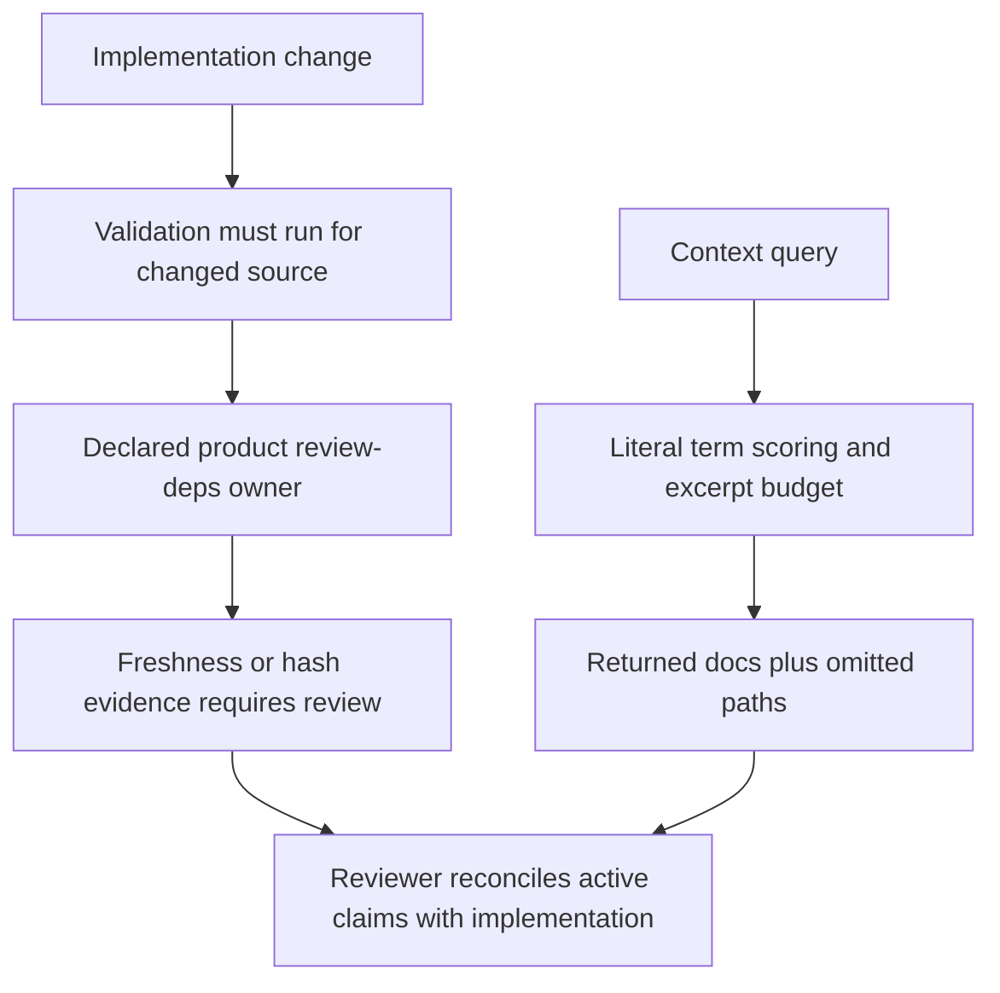

# PostPrint product guidance incident — 2026-10-04

<!-- source-of-truth: PostPrint product guidance incident findings, reproduction, and Skeleton detection boundaries -->

<!-- doc-meta: owner=eng | last-reviewed=2026-10-10 -->

<!-- review-deps: paths=scripts/reproduce-postprint-guidance-incident.py,src/context.ts,src/validate/changed.ts,src/audit/rules/index.ts,src/audit/core/review-coverage.ts -->

**Finding:** PostPrint combined missing product-to-implementation dependencies,
disabled owner coverage, date-only review evidence, and scoped invocation paths.
Skeleton 5.0.4 also lacks a built-in semantic comparison between product prose and
implementation. Its supported dependency review gate works in the reproduction.
There was an available freshness signal: a targeted audit of the original product
docs fails on two review dates. This incident is therefore a combination of
integration and invocation gaps plus unsupported semantic coverage, rather than
a reproduced failure of the dependency detector.

The configuration gaps are PostPrint-specific. The semantic and retrieval limits
apply to other Skeleton consumers. Neither a successful catalog nor a strict audit
proves that an active product model agrees with code.

## Scope and immutable evidence

[PostPrint PR #675](https://github.com/post-print/applications/pull/675) reconciled
20 product, design, and domain documents. GitHub readback during this investigation
reports **merged**, on 2026-10-04 at 15:03:28 UTC, merge commit
`b2508a6a70f74f2ce3528dfc7b930c9f8feb4008`. The handoff's draft status is historical.
The investigation keeps the original comparison pinned:

| Evidence | Revision |
| --- | --- |
| Stale annotations-branch baseline / PR base | `e04277ea94744fc4d6fa88b690135b417f07bd29` |
| Reconciled docs / PR head | `3c6f47af806fab7ef897ae72d70dea977165de8a` |
| Main baseline inspected by the reconciliation | `27ba6155ee98341067bf9b8cf52b51b816696d74` |
| Removal of `DocumentSourceRef`, PR #606 | `bf40bb3b3e90456e4e3e2b56e48bfb1ff898cb56` |
| Skeleton source HEAD and `v5.0.4` tag | `411e07dd89aba86a2ad312dbb1e96f32bc762807` |

Original and cleanup PostPrint checkouts were read only. Replays used disposable
local clones with detached HEADs and hooks disabled. No app dependencies were
installed, no application code was executed, and no PostPrint files were changed.
The original investigation retained existing Skeleton work and added this report,
its reproduction, and a review-lock entry. The baseline sections below describe
5.0.4, before the separately documented prevention follow-up.

## What conflicted

| Active guidance before reconciliation | Verified implementation / disposition |
| --- | --- |
| [Object model at the base](https://github.com/post-print/applications/blob/e04277ea94744fc4d6fa88b690135b417f07bd29/docs/product/object-model.md) called Option D accepted, prescribed document evidence refs and `/cite`, froze annotations, and listed `DocumentSourceRef` as an evolving owner. | [Migration 0091](https://github.com/post-print/applications/blob/e04277ea94744fc4d6fa88b690135b417f07bd29/apps/backend/postprint/papers/migrations/0091_delete_documentsourceref.py) deletes that model. [Main annotation models](https://github.com/post-print/applications/blob/27ba6155ee98341067bf9b8cf52b51b816696d74/apps/backend/postprint/annotations/models.py) already contain server-backed comments/tasks. [Main document models](https://github.com/post-print/applications/blob/27ba6155ee98341067bf9b8cf52b51b816696d74/apps/backend/postprint/papers/models.py) contain documents, versions, and edit intents. |
| [Active alignment plan](https://github.com/post-print/applications/blob/e04277ea94744fc4d6fa88b690135b417f07bd29/docs/product/north-star-alignment-gameplan.md) described PDF annotations as local-only and directed work toward an evidence-ref schema, editor `/cite`, and annotation retirement. | Main already contradicted the local-only description. The annotation branch adds richer location/snapshot evidence and revision integration; it is not evidence that all branch features were on main or deployed. |
| Product, surface, and domain documents repeated those prescriptions. | [Reconciled object model](https://github.com/post-print/applications/blob/3c6f47af806fab7ef897ae72d70dea977165de8a/docs/product/object-model.md) makes current ownership and delivery boundaries explicit. [ADR-002](https://github.com/post-print/applications/blob/3c6f47af806fab7ef897ae72d70dea977165de8a/docs/product/decisions/002-annotations-and-documents.md) supersedes the active implementation prescription. |

This is not a finding that every mention of `/cite` or evidence refs is wrong.
The original model explicitly admitted partial implementation, and some rows were
future intent. The conflict is the continuing **active ownership and retirement
prescription**, coupled with incorrect current-capability descriptions. The
[historical exploration](https://github.com/post-print/applications/blob/3c6f47af806fab7ef897ae72d70dea977165de8a/docs/product/note-model-exploration.md)
retains A/B/C/D alternatives. Future claim-to-source citation relationships remain
unresolved; captured annotation evidence does not establish that capability.
ADR-002 preserves the external ADR-001 link without claiming to have edited Linear.

## Executable and invocation provenance

PostPrint's base/head manifests pin Skeleton **5.0.4**. The original checkout and
cleanup worktree currently resolve `node_modules/.bin/skeleton` to
`../@csark0812/skeleton/dist/cli.js`; both installed packages report 5.0.4 and their
bundles have SHA-256:

```text
ef26f14cf251e44a618d0c5a45eec4bde9f90e2c131ba7b5b403ca5e5522e694
```

The copied Skeleton skill also matches the installed package byte for byte.
At the investigation baseline, source runtime files relevant to this incident matched `v5.0.4`;
uncommitted efficacy/test work is outside those runtime files. The reproduction
runs the installed Node bundle and current Bun source separately. Runtime versions
were Node 26.7.0 and Bun 1.4.0.

The recovered local session `01a1074b-8c32-78b3-b39f-19a92f66373c`
(“Compare Beeblio OSS to PostPrint”)
contains these receipts. Times are UTC; the recorded commands use
`npx --no-install skeleton context` in the original checkout.

| Time on 2026-10-04 | Command / verified result |
| --- | --- |
| 14:22:52 | Product comparison query returned design-system and client-web docs, both `unreviewed`; object model and alignment plan were omitted. |
| 14:30:33 | Workflow comparison query returned the stale alignment plan and product surfaces as `unreviewed`, plus AGENTS/client-web; object model was omitted. |
| 14:38:57 and 14:42:28 | Cleanup/reconciliation queries returned co-editing architecture; object model and alignment plan were omitted. These are after manual discovery. |
| 15:00:04 | Cleanup commit `3c6f47af8` completed. Its actual receipt reports catalog generation, strict staged-doc audit, and Skeleton staged validation **Passed**. |
| 15:04:38 | Incident query returned consumer UI guidance; object model and alignment plan were omitted. This observation is after discovery. |

The trace has no pre-discovery product `audit docs`, `catalog`, or
`validate changed` receipt. That establishes an invocation gap **within this
session**, not the absence of all earlier checks. Hook configuration is evidence
of intended invocation, not proof a particular hook ran on every earlier commit.
Current bundle hashes do not retroactively prove which bytes each historical
`npx` process used. In particular, the September removal commit pins **5.0.2**;
replaying that commit with 5.0.4 is a counterfactual, not a reconstruction of its
installed executable or CI.

## Detection boundary and contributing factors



| Layer | Verified behavior | Incident implication |
| --- | --- | --- |
| Registration / scan | `docs/**` is included. At the base, the collector registers 18 product Markdown documents, all with no `review-deps`. The object model, alignment plan, ADR index, and exploration are present in generated catalog/context candidates. | The key papers were not missing from the scan or catalog. Other unmarked surface docs are not independent context candidates. A `source-of-truth` marker describes authority; it does not validate the claim against code. |
| Owner coverage | [PostPrint config](https://github.com/post-print/applications/blob/e04277ea94744fc4d6fa88b690135b417f07bd29/skeleton.toml) explicitly sets `[reviewCoverage] include = []`. [Coverage implementation](../../src/audit/core/review-coverage.ts) treats that as disabled. | No missing-owner gate required a product paper to claim the changed model/migration. Coverage can require at least one owner, but cannot require every relevant product/design paper to own it. |
| Review proof / freshness | PostPrint omits `[reviewProof]`. Date metadata checks the paper's own last Git edit and 180-day cadence. Hash mode is opt-in for this existing consumer. | Changing implementation alone cannot invalidate an undeclared product dependency. The stale object model and alignment plan nevertheless fail own-edit freshness checks: reviewed 09-10 vs edited 09-19, and reviewed 09-19 vs edited 09-21. |
| Changed-file impact | [Impact discovery](../../src/validate/changed.ts) matches direct `review-deps` patterns against changed paths. It does not infer ownership from ordinary prose code pointers, Markdown links, imported types, or semantic relationships. | Removing a model inside `models.py` can invalidate a paper declaring that file even if the file survives. Neither product paper declared it. The paper's prose pointer to `models.py` does not count. |
| Hooks / wrapper | [Hook config](https://github.com/post-print/applications/blob/e04277ea94744fc4d6fa88b690135b417f07bd29/.pre-commit-config.yaml) runs the catalog for broad app changes. The strict wrapper audits staged path selections; the dedicated Skeleton staged hook is restricted to documentation-oriented paths. [Consumer validation wrapper](https://github.com/post-print/applications/blob/e04277ea94744fc4d6fa88b690135b417f07bd29/scripts/validate/validate-changed.ts) routes Python/TS to code checks, docs to path-scoped audits. | A code-only model change is not sufficient to run the dedicated impact validator. Auditing a Python path as a selected doc is not reviewing its dependent product corpus. The actual removal commit also changed the alignment plan and MCP docs, so it could trigger hooks: do not attribute that commit's outcome solely to a code-only filter. |
| Semantic audits | [Rule inventory](../../src/audit/rules/index.ts) checks links, metadata, dependencies/proof, coverage, authority syntax, duplicate text, summary/body lexical fit, and configured policies. PostPrint has no configured semantic plugin/policy. | There is no built-in assertion that a named model exists, that annotation ownership agrees across prose/code, or that planned UX is implemented. Duplicate/summary rules do not establish factual consistency. |
| Context ranking | [Context implementation](../../src/context.ts) scores each distinct query term once by substring presence across summary/path/body, then breaks ties by path. `documentation` is a stop term. There is no product-intent relevance model or conflict comparison. | For the incident query, consumer UI guidance and the alignment plan each score 4; UI guidance sorts first. The object model scores 3. Ranking explains this query result, not the earlier human/agent miss by itself. |
| Budget / omissions | Default excerpt budget is 12,000 characters. A selected paper's declared sources/tests consume that budget before later papers. `omitted` lists excluded candidate paths; the formatter emits no mandatory action for a nonempty omitted list. The installed skill permits further discovery when evidence is omitted. | The broad UI owner consumes the default budget. Increasing to 1,000,000 characters returns the product model in both pinned states, still `unreviewed`. The default incident query omits it in both states. A successful exit is not evidence of completeness. |
| Context freshness | Without a recorded document hash, context returns `unreviewed`. Its comparison/action path requires matching recorded document bytes and changed declared source hashes. It does not run the Git-date audit. | The stale plan can be retrieved without the actionable stale-source diagnosis that configured hash proof would supply. `unreviewed` means evidence is missing; it is not approval of the content. |

Full strict audits of the original and reconciled snapshots fail with 52 and 46
`doc-meta` errors respectively. The scoped stale four-paper audit has two errors;
the reconciled 20-paper audit passes. Thus this investigation does **not** claim
the original PostPrint repository passed a full strict audit, nor that the cleanup
made every repository paper fresh.

The 5.0.4 replay of the model-removal commit also fails on the alignment plan's
own Git-date freshness. It does not report a dependency impact on the object
model. The plan was touched in that commit, which explains its freshness signal.
We have not established how that September signal was handled historically.

## Focused reproduction and controls

[Executable reproduction](../../scripts/reproduce-postprint-guidance-incident.py)
creates three small fixture papers: active model, historical alternatives, and
future aspirations, plus a Python model file. Fixtures use current metadata and
isolated Git histories, removing date noise without altering PostPrint history.
The stale and reconciled cases differ only in active prose; both retain the
history and aspiration controls. This is a deterministic CLI boundary test, not
a live-agent efficacy claim.

```bash
# Exact consumer artifact; supply its absolute path.
python3 scripts/reproduce-postprint-guidance-incident.py \
  --cli /path/to/postprint/node_modules/@csark0812/skeleton/dist/cli.js \
  --postprint /path/to/postprint \
  --output /private/tmp/skeleton-guidance-installed

# Current source, independently of the installed executable.
python3 scripts/reproduce-postprint-guidance-incident.py \
  --runtime bun --cli src/cli.ts \
  --output /private/tmp/skeleton-guidance-source
```

`--postprint` is optional. It requires local Git objects for the pinned revisions;
the minimal reproduction needs only Python, Git, and the supplied CLI/runtime.
The runner writes command receipts, stdout/stderr, CLI digest, and `summary.json`.
It removes its fixtures/clones on exit, including assertion failure. Large stdout
goes to file sinks so a Node buffered pipe followed by process exit cannot truncate
expanded retrieval evidence. It never reads credentials or app environments.

| Case | Installed 5.0.4 | Baseline source at `411e07d` |
| --- | --- | --- |
| Fresh metadata, stale active model, no dependency/proof | Full strict audit exits 0; context returns stale guidance as `unreviewed`, with no per-document action. | Same |
| Reconciled active prose, identical metadata/config/source | Full strict audit exits 0; context still says `unreviewed`. | Same |
| Historical alternatives and unresolved future citations | Both remain valid and retrievable; audit exits 0. | Same |
| `context --path=src/models.py`, no declared owner | `no-context` with recovery action; exit 0. | Same |
| Coverage enabled for unowned model file | Validation exits 1, requiring an owning paper. | Same |
| Direct dependency, date mode; remove model class while file survives | Validation exits 1 with `docs/model.md: review required`. | Same |
| Direct dependency and recorded hash; remove model class | Audit exits 1 with `review-dependency-changed`; context says `changed-since-review` and returns an action. | Same |

The original PostPrint replay additionally checks catalog generation/currentness,
scoped and full audits, default/expanded retrieval, missing model-path owner, model
and migration validation, and the removal commit against its parent. Catalog
checks pass in both states. Direct model/migration validation exits 1 with the
explicit skipped-code warning, not a product review result. The warning is an
honest boundary, not a successful validation.

Local raw evidence is retained under
`test-results/incidents/postprint-product-guidance-2026-10-04/`:
the `installed-5.0.4/summary.json` and `current-source/summary.json` hold run
receipts; `historical-invocations.json` holds a focused session extraction;
`stale-product-registration.json` and `stale-query-ranking.json` hold registration
and ranking evidence. This ignored output can be regenerated; the script and
immutable source links are the durable evidence. No PostPrint diff is copied here.

## Recommended correction and regression gate

**Smallest correction: wire the existing review mechanism to the active product
owner, then require it at the source-change boundary.** This is a recommendation;
the consumer integration remains required. The Skeleton follow-up below implements
review and omission actions, rather than a semantic detector.

| Order / owner | Concrete change | Acceptance gate |
| --- | --- | --- |
| 1 — PostPrint product/engineering | Have `docs/product/object-model.md` declare `papers/models.py`, `annotations/models.py`, and the relevant document-edit ownership sources by full repo-relative paths. Include migration 0091 as inspected evidence. Review the active model/ADR against those sources; the existing date-mode dependency gate is sufficient to start. Give other active papers dependencies for their own factual claims; use root model/ADR links to route the wider manual reconciliation. | `context --path=<model>` returns the product owner with source evidence. A code-only change to a declared implementation path triggers required review. Historical alternatives and unimplemented aspirations remain explicitly qualified. |
| 2 — PostPrint validation | Replace the empty coverage include with a narrow set covering those model/contract paths. Run Skeleton `validate changed --staged` for source changes as well as docs, or run its equivalent impact pass from the existing wrapper/CI. Do not substitute the staged-doc audit or catalog generator. | An unowned relevant source fails; a code-only declared dependency change fails until reviewed. Check the actual installed bundle and hook command, then capture the receipt. |
| 3 — Skeleton regression ownership | Retain this reproduction as a boundary case; add the positive owner/coverage/hash cases to the CLI regression suite when implementing integration changes. Any future semantic checker must grade active ownership claims separately from historical and aspirational statements. | Stale active prose must not become a semantic pass by updating dates alone. History/future controls stay valid. Report the current known semantic miss honestly until that capability exists. |
| 4 — Skeleton retrieval follow-up | Consider a structured action for omitted evidence and a budget reservation for additional matched papers before one owner's source excerpts consume all space. Keep path ownership recovery explicit. | A bounded query exposes the relevant active owner or a required omission follow-up. Correctness is measured against final evidence, not only exit status or keyword presence. |

Steps 1–2 prevent recurrence through supported dependency review; they do not
automatically judge prose truth. They also do not establish transitive invalidation
of every linked paper: current impact discovery follows direct declared edges.
Review all active references when a product decision changes, and declare additional
direct dependencies where a paper independently states implementation facts.
A general semantic detector is a separate, larger product decision and is not
needed to make the existing review gate useful.

Hash proof is a useful follow-up for byte-accurate freshness and actionable context.
Enabling it is repository-wide: it requires recorded proof for the selected audit
corpus, so a full audit needs more than one product-owner attestation. Plan that
migration and review debt explicitly instead of enabling it and assuming a single
new lock entry makes the consumer pass. The minimal correction above can use
existing date-mode impact enforcement first.

## Remaining uncertainty and completion boundary

- The focused session proves context and post-cleanup hook invocations. It does
  not reconstruct every earlier agent session, CI run, hook bypass, or reviewer
  response to freshness failures.
- Installed 5.0.4 behavior and baseline source are independently reproduced.
  Historical executable identity, especially 5.0.2 at model removal, is not proved
  by today's installation or the counterfactual removal replay.
- Retrieval omissions and absence of source proof are contributing conditions.
  The trace also shows stale product guidance was returned before cleanup; omission
  alone cannot explain the whole incident or prove an agent would have caught it.
- Source declarations, migrations, and reconciled ADRs prove this documentation
  mismatch. They do not prove production rollout, database migration application,
  end-to-end user acceptance, or enforcement of every intended AI workflow.
- The shared prevention follow-up makes missing evidence actionable. PostPrint
  ownership declarations and source-triggered validation remain a separate
  consumer change. Neither layer automatically judges prose truth.

## Prevention follow-up

The shared change in `src/context.ts` adds review actions for absent proof and
review dates behind a document edit or cadence. It partitions the excerpt budget
across matching papers, lists omitted sources, and requires a relevant omission
follow-up. Hash comparison checks the complete dependency set, so deleting a file
covered by a declared glob invalidates the recorded review. The Node CLI now
lets stdout drain before exiting; a large piped packet is checked against the Bun
source output. Packaged skill and init guidance treat review gaps as incomplete
evidence and preserve history and future intent.

Run the candidate with explicit prevention expectations:

```bash
python3 scripts/reproduce-postprint-guidance-incident.py \
  --cli dist/cli.js --expect-prevention \
  --postprint /path/to/postprint \
  --output /private/tmp/skeleton-guidance-prevention
```

The minimal stale and reconciled cases still both pass a strict structural audit;
the candidate now returns a source-comparison action for each unreviewed active
paper. Historical and future controls remain valid. In the pinned PostPrint
replay, the default packet returns the alignment plan with a required review,
retains the object model in the omitted list, and emits an omission action.
Expanded retrieval returns the object model with a review action. These assertions prove
actionable evidence, not that an autonomous reviewer will reconcile every claim.

The PostPrint upgrade must still implement recommendation steps 1–2. Refresh
the copied Skeleton skill and existing context guide along with the package;
`init` preserves an existing marked guide rather than replacing it. Prefer the
existing date-mode impact gate for a narrow rollout unless repository-wide hash
review debt is explicitly addressed. Confirm a code-only declared source change
fails until its owning paper is reviewed, an unowned covered path fails, and
qualified historical and aspirational prose stays valid.

Validation of this follow-up: `bun run check` passed 299 deterministic tests,
typecheck, build, and self-audit (four existing advisory summary warnings).
`bun run agent:test:check` discovered 15 tests and passed nine offline SDK
contracts; no new live-agent qualification is claimed. Package verification and
changed-file validation passed. The initial prevention candidate at `18c1801` and its unpacked npm artifact
share SHA-256 `112660b94358c993e0762707c5787ede8cdd635558d0ebf9881b24e657ec6442`.
The candidate replay passed 40 CLI receipts including pinned PostPrint snapshots;
the packed candidate passed 21 minimal receipts. An independent installed 5.0.4
recheck passed the original 21-receipt missing-action baseline. These receipts
remain in the ignored evidence directory under `prevention/`,
`packed-prevention/`, and `installed-baseline-recheck/`.

Release CI exposed two baseline infrastructure failures. The test workflow ran
bare `bun test` without generating ignored efficacy fixtures; it now runs
`bun run test`, which uses the existing preparation pipeline. The dependency
audit also found advisories in the existing overrides. The release updates
`fast-uri` to 3.1.8 and `undici` to 6.28.1; the resulting local audit reports
no vulnerabilities. These repairs retain the existing test and security gates.
